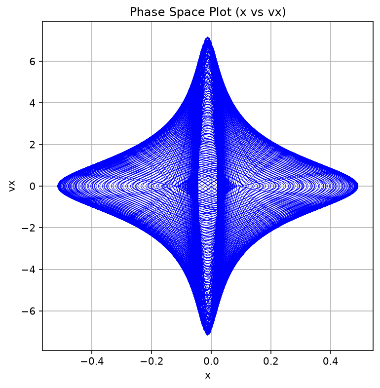
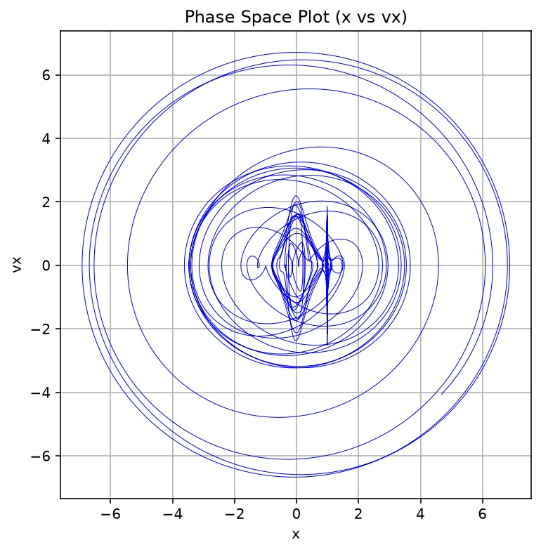
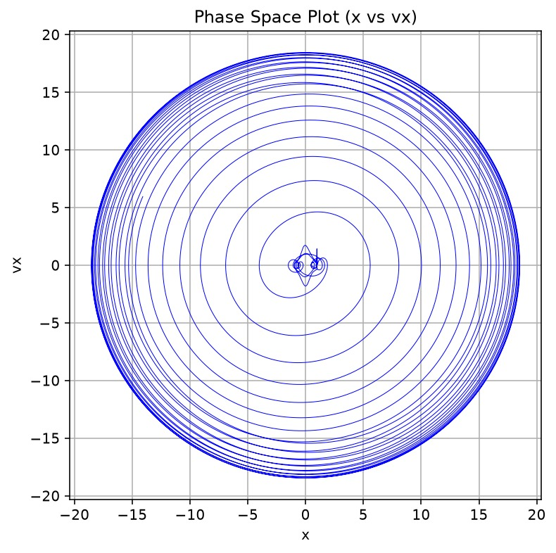
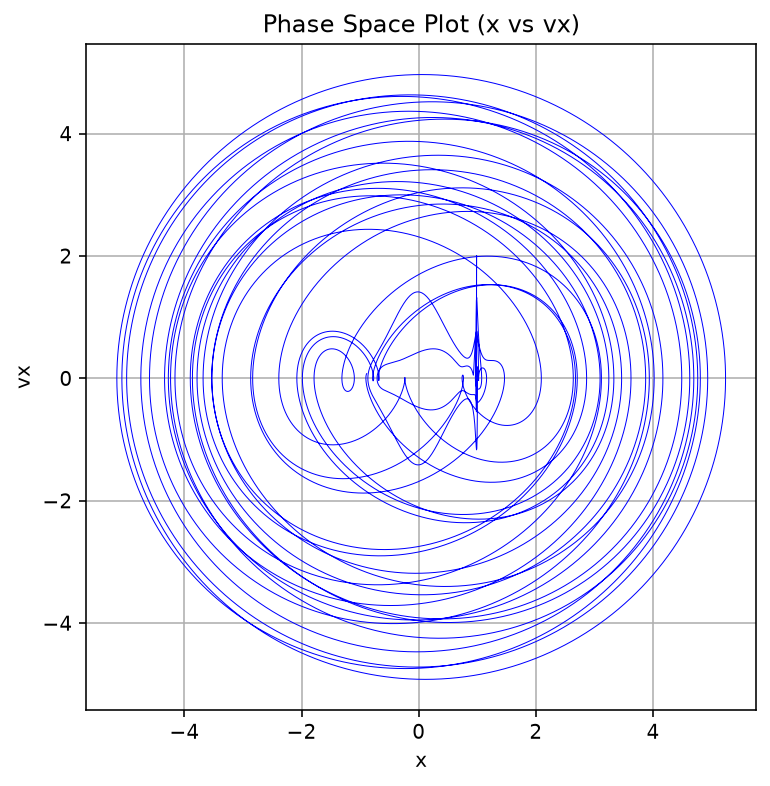

# Phase-Space Trajectory Analysis ($x$ vs $v_x$)

This directory contains 2D phase-space projections onto the position-velocity plane $(x, v_x)$ generated from numerical integrations of the Circular Restricted Three-Body Problem (CR3BP).

## Theoretical Overview

In classical mechanics, the state of a dynamical system is completely specified by its phase-space coordinates. For the 2D CR3BP, the full phase space is 4-dimensional:

$$\mathbf{X}(t) = \begin{bmatrix} x(t) \\ y(t) \\ v_x(t) \\ v_y(t) \end{bmatrix}$$

Projecting this 4D state trajectory onto the $x\text{--}v_x$ plane maps position along the synodic x-axis against its corresponding linear velocity component $v_x = \frac{dx}{dt}$. 

* **Closed, repeating loops:** Represent regular, periodic, or quasi-periodic motion where kinetic and potential energy exchange predictably.
* **Overlapping, space-filling loops:** Indicate non-linear coupling, large-amplitude libration, or deterministic chaotic behavior.

---

## Detailed Analysis of Phase-Space Plots

### 1. Bounded Rosette Orbit (Zero Initial Velocity)

* **Filename:** `Phase_Space_zero_vsl-x-vx.png`
* **Initial Conditions:** $x = 0.4920$, $y = -0.01286$, $v_x = 0.0$, $v_y = 0.0$
* **Phase-Space Bounds:** $x \in [-0.5, 0.5]$, $v_x \in [-7.0, 7.0]$
* **Physical Interpretation:** The plot forms a dense, symmetrical, diamond-shaped region bounded strictly within $|x| \le 0.5$. The narrow spatial range along $x$ combined with large, smooth velocity oscillations along $v_x$ confirms that the third body is tightly bound deep within the primary's gravitational well, executing a precessing, quasi-periodic rosette trajectory with zero outward spatial drift.

---

### 2. Collinear $L_1$ Region Instability

* **Filename:** `Phase_Space_L1-x-vx.jpeg`
* **Initial Conditions:** Perturbed initial state near the $L_1$ collinear Lagrange point
* **Phase-Space Bounds:** $x \in [-7.5, 7.5]$, $v_x \in [-7.0, 7.0]$
* **Physical Interpretation:** The trajectory displays an intricate, figure-eight central core near $x \approx 0 \text{--} 1$ before rapidly expanding into large, multi-loop orbits spanning $x \in [-7, 7]$. This phase-space geometry visually captures the unstable nature of $L_1$, where small initial perturbations force the body out of the equilibrium region into wider, chaotic planetary orbits.

---

### 3. Triangular $L_4$ Point Libration & Expansion

* **Filename:** `Phase_Space_L4_x_vx.jpeg`
* **Initial Conditions:** Perturbed initial state near the $L_4$ triangular Lagrange point
* **Phase-Space Bounds:** $x \in [-20.0, 20.0]$, $v_x \in [-20.0, 20.0]$
* **Physical Interpretation:** Beginning near the origin with small oscillatory loops, the trajectory steadily expands outward in a series of highly regular, concentric phase-space rings reaching $|x| \approx 19$ and $|v_x| \approx 19$. This concentric structure illustrates large-amplitude libration around the $L_4$ point, capturing the smooth, continuous transfer between potential position and kinetic velocity over extended integration times.

---

### 4. Secondary Mass Chaotic Perturbation

* **Filename:** `Phase_Space_random_x-vx.png`
* **Initial Conditions:** $x = 0.9720$, $y = -0.14143$ (Near secondary mass $m_2$)
* **Phase-Space Bounds:** $x \in [-5.5, 5.5]$, $v_x \in [-5.0, 5.0]$
* **Physical Interpretation:** The phase-space trajectory shows asymmetric, multi-layered overlapping loops with a distinct double-well feature around $x \approx 0$ and $x \approx 1$. The irregular crossings across $v_x = 0$ reflect chaotic scattering, where gravitational encounters with the secondary body continuously alter the orbit's momentum and energy state.
