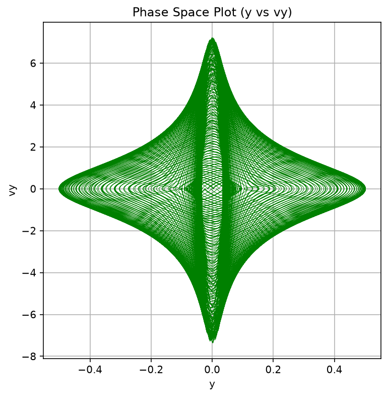
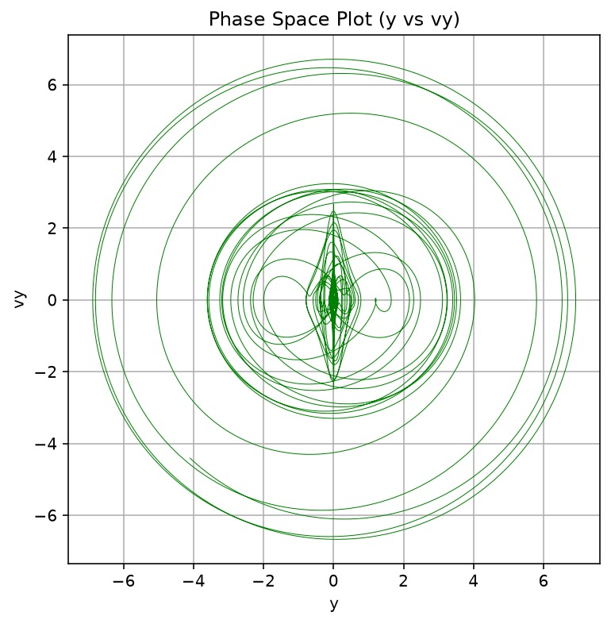
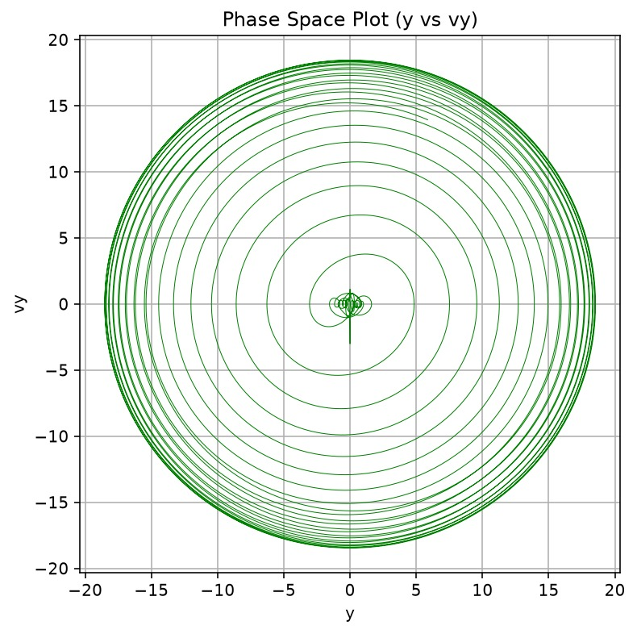
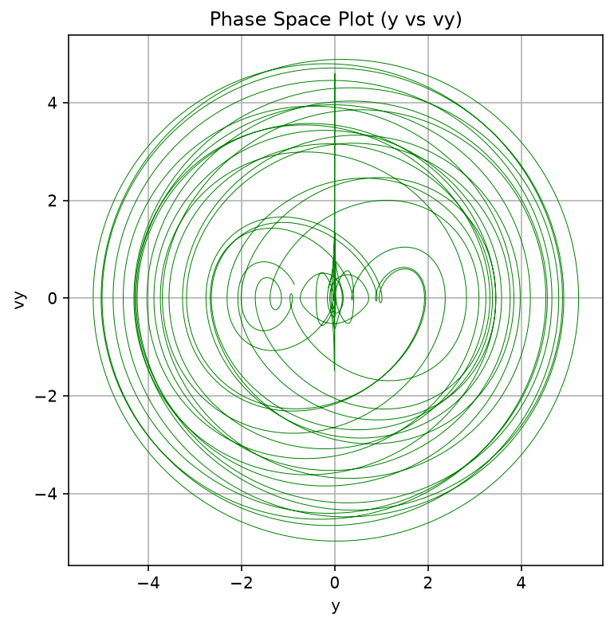

# Phase-Space Trajectory Analysis ($y$ vs $v_y$)

This directory contains 2D phase-space projections onto the transverse position-velocity plane $(y, v_y)$ generated from numerical integrations of the Circular Restricted Three-Body Problem (CR3BP).

## Theoretical Overview

While the $(x, v_x)$ plots visualize dynamics along the primary axis of the binary system, projecting the 4D state trajectory onto the $y\text{--}v_y$ plane maps the transverse spatial position against its corresponding linear velocity component $v_y = \frac{dy}{dt}$. 

Analyzing the transverse phase space is crucial for understanding how celestial bodies drift perpendicularly to the binary axis.
* **Symmetrical, bounded shapes:** Indicate strict confinement and regular energy exchange in the transverse direction.
* **Unstructured, expanding circles:** Indicate chaotic drift, orbital ejection, or large-scale libration across the rotational plane.

---

## Detailed Analysis of Phase-Space Plots

### 1. Bounded Rosette Orbit (Zero Initial Velocity)

* **Filename:** `Phase_space_zero_vel_y-vy.png`
* **Initial Conditions:** $x = 0.4920$, $y = -0.01286$, $v_x = 0.0$, $v_y = 0.0$
* **Phase-Space Bounds:** $y \in [-0.5, 0.5]$, $v_y \in [-7.5, 7.5]$
* **Physical Interpretation:** The plot forms a perfectly symmetrical, vertically elongated diamond (or spindle) structure. The strict confinement along the $y$-axis ($|y| \le 0.5$) coupled with dense, highly ordered velocity oscillations proves that the third body experiences zero chaotic drift perpendicular to the binary axis. The transverse motion is strictly regular and bounded deep within the primary's Roche lobe.

---

### 2. Collinear $L_1$ Region Instability

* **Filename:** `Phase_space_L1_y-vy.jpeg`
* **Initial Conditions:** Perturbed initial state near the $L_1$ collinear Lagrange point
* **Phase-Space Bounds:** $y \in [-7.0, 7.0]$, $v_y \in [-7.0, 7.0]$
* **Physical Interpretation:** Starting from a small central figure-eight structure near the origin, the trajectory violently expands outward into large, overlapping, chaotic circles. This demonstrates that transverse perturbations near the $L_1$ saddle point are highly unstable, leading to rapid ejection from the equilibrium zone and unpredictable wandering across the orbital plane.

---

### 3. Triangular $L_4$ Point Libration & Expansion

* **Filename:** `Phase_space_L4_y-vy.jpeg`
* **Initial Conditions:** Perturbed initial state near the $L_4$ triangular Lagrange point
* **Phase-Space Bounds:** $y \in [-20.0, 20.0]$, $v_y \in [-20.0, 20.0]$
* **Physical Interpretation:** The trajectory expands outward in extremely dense, regular concentric rings. Unlike the chaotic tangles of $L_1$, these smooth concentric spirals indicate predictable, large-amplitude libration. The energy transfer between transverse position and velocity remains highly structured over time, visualizing bounded tadpole or horseshoe orbits expanding gradually due to integration length.

---

### 4. Secondary Mass Chaotic Perturbation

* **Filename:** `Phase_space_random_y-vy.png`
* **Initial Conditions:** $x = 0.9720$, $y = -0.14143$ (Near secondary mass $m_2$)
* **Phase-Space Bounds:** $y \in [-5.0, 5.0]$, $v_y \in [-5.0, 5.0]$
* **Physical Interpretation:** The plot reveals a highly asymmetric, multi-layered orbital structure with prominent internal off-center loops. The lack of clean concentricity and the erratic crossings across the $v_y = 0$ axis confirm chaotic scattering. The gravitational influence of the secondary body continuously warps the trajectory's transverse momentum, preventing the formation of a stable, periodic orbit.
