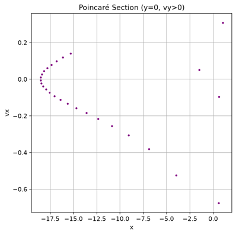
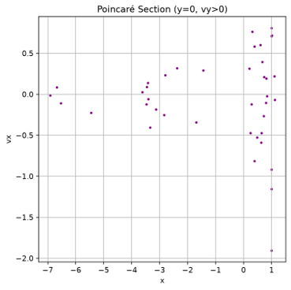

# Poincaré Sections & Phase-Space Dynamics

This directory contains 2D Poincaré sections generated from the numerical integration of the Circular Restricted Three-Body Problem (CR3BP). 

## Methodological Overview
In the CR3BP, the full phase space is 4-dimensional: $(x, y, v_x, v_y)$. Because the Jacobi constant $C$ is conserved, the system's dimensionality is reduced to 3. Taking a surface of section at the equatorial plane crossing:

$$\Sigma = \{ (x, y, v_x, v_y) \in \mathbb{R}^4 \mid y = 0, v_y > 0 \}$$

reduces continuous 3D trajectories into 2D discrete maps on the $(x, v_x)$ plane. This provides a definitive visual diagnostic to distinguish between regular (quasi-periodic) motion and deterministic chaos:
* **Smooth closed curves / 1D loops:** Indicate regular, quasi-periodic motion residing on invariant Kolmogorov-Arnold-Moser (KAM) tori in phase space.
* **Scattered, space-filling dots:** Indicate non-periodic, unstable, or chaotic trajectories.

---

## Analysis of Poincaré Sections

### 1. Bounded Quasi-Periodic Motion (Rosette Orbit)
_zero_velocity.png)

* **Filename:** `pointcare_(0.4920000000000000 ,-0.0128571428571429)_zero_velocity.png`
* **Initial Conditions:** $x = 0.4920$, $y = -0.01286$, $v_x = 0.0$, $v_y = 0.0$ (Zero initial velocity in rotating frame)
* **Surface of Section:** $y = 0$, $v_y > 0$
* **Dynamical Interpretation:** The Poincaré section displays a single, continuous, highly defined closed loop on the $(x, v_x)$ plane ($x \in [0.02, 0.47]$, $v_x \in [-3.4, 3.4]$). This smooth 1D boundary represents the cross-section of a 2D invariant torus in phase space. It proves that deep within the primary's gravitational well, the motion is strictly regular, bounded, and quasi-periodic (precessing rosette orbit), with zero computational drift or chaos.

---

### 2. Triangular Equilibrium Point ($L_4$) Libration

* **Filename:** `L4_poincare.png`
* **Initial Conditions:** Perturbed state near $L_4$ triangular equilibrium point
* **Surface of Section:** $y = 0$, $v_y > 0$
* **Dynamical Interpretation:** The plot shows a structured, smooth arc formed by consecutive crossings along $x \in [-18.5, -15.0]$, with mild dispersion at larger values of $x$. This structure demonstrates regular, large-amplitude oscillatory motion (libration) around the triangular equilibrium region before weakly spreading due to non-linear perturbations over extended integration times.

---

### 3. Collinear Equilibrium Point ($L_1$) Instability

* **Filename:** `L1_poincare.png`
* **Initial Conditions:** Perturbed state near $L_1$ collinear equilibrium point
* **Surface of Section:** $y = 0$, $v_y > 0$
* **Dynamical Interpretation:** The intersection points are highly scattered across $x \in [-7.0, 1.2]$ and $v_x \in [-2.0, 0.8]$. The absence of a single closed invariant curve—combined with the dense concentration of points near $x \approx 0.8 \text{--} 1.1$ (the Earth-Moon $L_1$ region)—proves that motion near $L_1$ is non-periodic, unstable, and nonlinearly coupled, leading to trajectory divergence.

---

### 4. Chaotic Scattering near Secondary Mass
.png)

* **Filename:** `poincare_(0.9720000000000000, -0.1414285714285715).png`
* **Initial Conditions:** $x = 0.9720$, $y = -0.14143$ (In close proximity to secondary body $m_2$)
* **Surface of Section:** $y = 0$, $v_y > 0$
* **Dynamical Interpretation:** The plot exhibits completely unstructured, pseudo-random scatter points distributed across $x \in [-5.2, 1.1]$ and $v_x \in [-0.5, 0.5]$. This pattern is a classic signature of **chaotic scattering**. The third body interacts intensely with the secondary mass, undergoing rapid energy transfer until it escapes the local region entirely.
